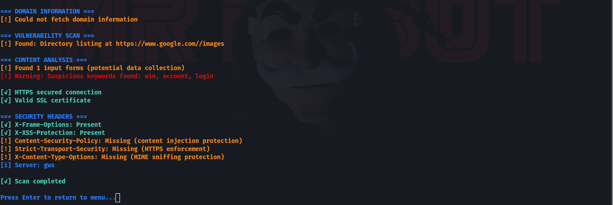
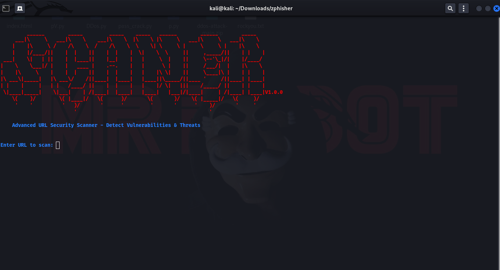

# SCANER-V1.0.0
# SCANER TOOL 🔓📡


📌 Description

DRAGON-URL is a powerful Python-based security tool designed to analyze websites for vulnerabilities, track domain information, and download HTML source code. It provides a user-friendly command-line interface with color-coded outputs for easy threat identification.

🔍 Key Features

✅ URL Security Scanning – Detects common vulnerabilities (WordPress, PHP, SQLi risks)
✅ IP & Domain Analysis – Shows IP location, ISP, domain age, and registrar details
✅ SSL/TLS Verification – Checks HTTPS security and certificate validity
✅ Suspicious Content Detection – Identifies phishing keywords, hidden forms, and iframes
✅ HTML Source Downloader – Saves complete webpage HTML to desktop as dragon.html
✅ User-Friendly Menu – Easy navigation with numbered options


⚠ **Warning**: Use this tool **only** on networks you own or have permission to test. Unauthorized access is illegal.  


  


## 📸 Screenshots  

### **SCREENSHOTS**  
  

### **SCREENSHOTS**  
  


### **SCREENSHOTS**  
  


### **SCREENSHOTS**  
  


## Installation  
Tested On :

    Kali Linux
    BlackArch Linux
    Ubuntu
    Kali Nethunter
    Termux ( Rooted Devices)
    Parrot OS

### Prerequisites  
- 𝙆𝘼𝙇𝙄 
- 𝐓𝐄𝐑𝐌𝐔𝐗 
-  𝐏𝐚𝐫𝐫𝐨𝐭 𝐎𝐒 
-  𝐔𝐛𝐮𝐧𝐭𝐮 


بــيــان إخــلاء المســؤولية القانونيــة

باللغة العربية:
١. هذه الأداة مخصصة لأغراض اختبار الأمن السيبراني القانوني فقط، ويجب استخدامها فقط على الشبكات التي تمتلكها أو لديك إذن كتابي لاختبارها.

٢. الاستخدام غير المصرح به لأي شبكة لاسلكية يعد انتهاكًا قانونيًا وفقًا لقوانين جرائم المعلوماتية في معظم الدول (مثل المادة 3 من نظام مكافحة الجرائم المعلوماتية السعودي، المادة ٨٨٠ من القانون المدني المصري).

٣. لا يتحمل المطور أي مسؤولية عن سوء الاستخدام أو الأضرار الناتجة عن هذه الأداة.

٤. يُنصح بشدة باستخدام هذه الأداة في بيئات معملية مغلقة أو خلال اختبارات الاختراق المصرح بها (Penetration Testing).
Legal Disclaimer

In English:

    This tool is designed only for legal cybersecurity testing purposes. Use exclusively on networks you own or have written permission to test.

    Unauthorized scanning/attacking of wireless networks violates cybercrime laws (e.g., Saudi Arabia's Anti-Cyber Crime Law Article 3, UAE Cybercrime Law No. 5/2012, US Computer Fraud and Abuse Act).

    The developer accepts no liability for misuse or damages caused by this tool.

    Recommended use cases:

        Authorized penetration testing

        Academic security research

        Certified training environments

    By using this tool, you acknowledge that:

        You understand applicable laws in your jurisdiction

        You accept full legal responsibility for your actions


## Installation Guides

```bash
# 1. Update system
sudo apt update && sudo apt full-upgrade -y

# 2. install python
 sudo apt install python3-pip

# 3. Clone repository
git clone https://github.com/ElliotV56/SCANER-V1.0.0.git
cd SCANER-V1.0.0

# 4. Run tool
python3 D-URL.py
