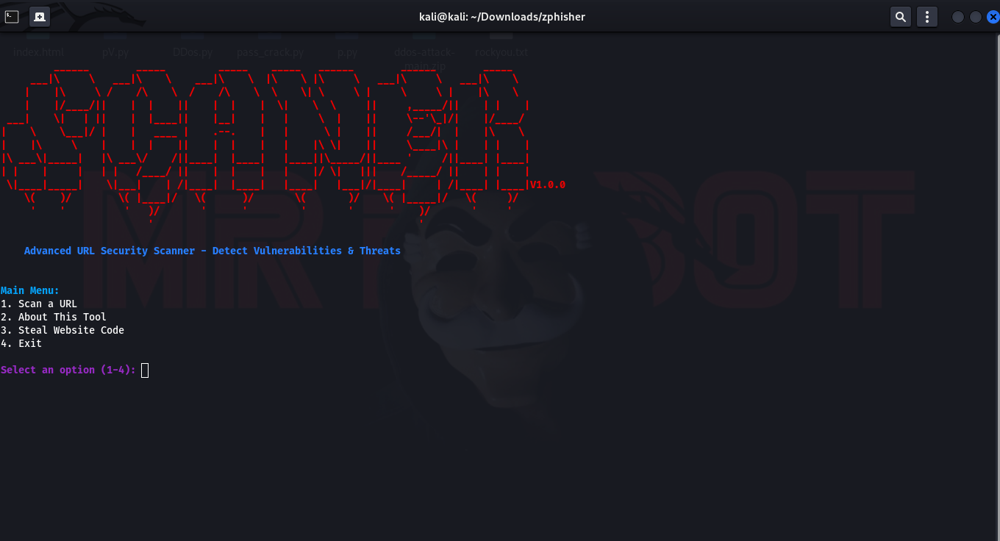
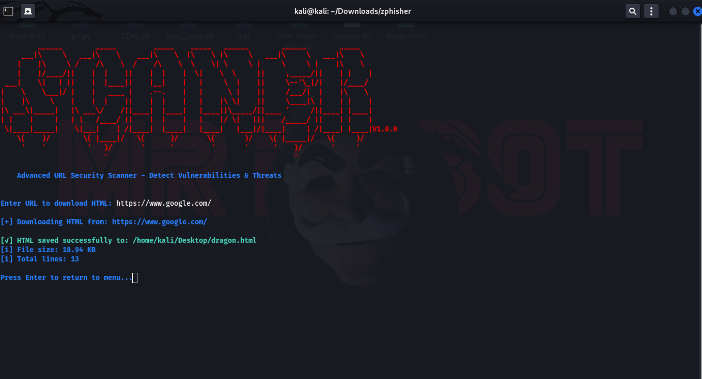

# SCANER-V1.0.0
# SCANER TOOL 🔓📡


📌 Description

DRAGON-URL is a powerful Python-based security tool designed to analyze websites for vulnerabilities, track domain information, and download HTML source code. It provides a user-friendly command-line interface with color-coded outputs for easy threat identification.

🔍 Key Features

✅ URL Security Scanning – Detects common vulnerabilities (WordPress, PHP, SQLi risks)
✅ IP & Domain Analysis – Shows IP location, ISP, domain age, and registrar details
✅ SSL/TLS Verification – Checks HTTPS security and certificate validity
✅ Suspicious Content Detection – Identifies phishing keywords, hidden forms, and iframes
✅ HTML Source Downloader – Saves complete webpage HTML to desktop as dragon.html
✅ User-Friendly Menu – Easy navigation with numbered options


⚠ **Warning**: Use this tool **only** on networks you own or have permission to test. Unauthorized access is illegal.  


  


## 📸 Screenshots  

### **SCREENSHOTS**  
  

### **SCREENSHOTS**  
  


## Installation  
Tested On :

    Kali Linux
    BlackArch Linux
    Ubuntu
    Kali Nethunter
    Termux ( Rooted Devices)
    Parrot OS

### Prerequisites  
- 𝙆𝘼𝙇𝙄 
- 𝐓𝐄𝐑𝐌𝐔𝐗 
-  𝐏𝐚𝐫𝐫𝐨𝐭 𝐎𝐒 
-  𝐔𝐛𝐮𝐧𝐭𝐮 


## Installation Guides

```bash
# 1. Update system
sudo apt update && sudo apt full-upgrade -y

# 2. install python
 sudo apt install python3-pip

# 3. Clone repository
git clone https://github.com/ElliotV56/WIFI-CrackV1.0.git
cd WIFI-CrackV1.0

# 4. Run tool
sudo python3 WIFI-C.py


  
